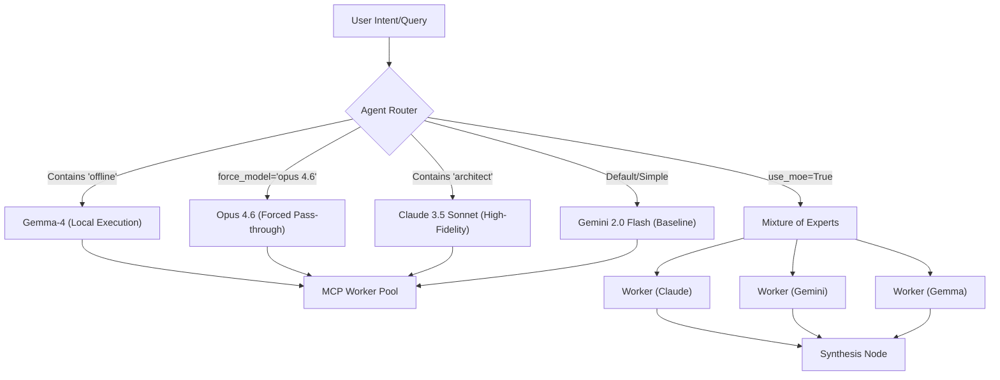

# 🧭 Aether Routing Experiments

This document showcases the experimental routing logics validating **Mixture of Experts (MoE)**, **Pass-Through (Opus 4.6)**, and **Offline Execution (Gemma 4)** capabilities within the Aether orchestration framework. 

## 🏗️ Routing Architecture

The `AgentRouter` sits at the heart of the Control Plane, dynamically calculating payload dispatches to the most appropriate MCP-enabled worker.



## 🧪 Experiment Results

Below are the traces from real evaluations run through the router inside the SCION architecture.

### Experiment 1: Forced Pass-Through to `opus 4.6`
**Scenario:** The developer forces the query to use a specific base model, bypassing intent-upgrade heuristic algorithms.
**Intent:** `"run test verify application"`
```json
{
  "intent": "run test verify application",
  "tool_name": "mcp_verifier",
  "path": "/usr/bin/verifier",
  "wc_score": 0.8,
  "preferred_model": "gemini-2.0-flash",
  "metadata": {},
  "match_score": 0.8,
  "recommended_model": "opus 4.6"
}
```

### Experiment 2: Offline Degradation (Airgapped)
**Scenario:** Utilizing keywords signaling a need for self-contained, offline execution (e.g., `"offline"`, `"local"`).
**Intent:** `"run test verify application offline"`
```json
{
  "intent": "run test verify application",
  "tool_name": "mcp_verifier",
  "path": "/usr/bin/verifier",
  "wc_score": 0.8,
  "preferred_model": "gemini-2.0-flash",
  "metadata": {},
  "match_score": 0.8,
  "recommended_model": "gemma-4"
}
```

### Experiment 3: Mixture of Experts (MoE)
**Scenario:** Broad-scope task requiring adversarial and divergent perspectives. The query triggers evaluating an array of specialized experts.
**Intent:** `"text processing data transformation"` (with `use_moe=True`)
```json
{
  "intent": "text processing",
  "tool_name": "text_tool",
  "path": "/path/tool",
  "wc_score": 1.0,
  "preferred_model": "gemini-2.0-flash",
  "metadata": {},
  "match_score": 1.0,
  "recommended_model": "gemini-2.0-flash",
  "moe_models": [
    "claude-3-5-sonnet-v2",
    "gemini-2.0-flash",
    "gemini-2.5-pro",
    "gemma-4"
  ]
}
```

## 🚀 Execution Strategy Conclusion
The Aether Swarm can now comfortably handle fallback to **Gemma 4** for secure data requirements, or force paths down alternative tracks like **Opus 4.6**, without cluttering the default `gemini-2.0-flash` execution paths. When divergence logic is required, the `moe_models` array will synthesize results from the major ecosystem entities.
